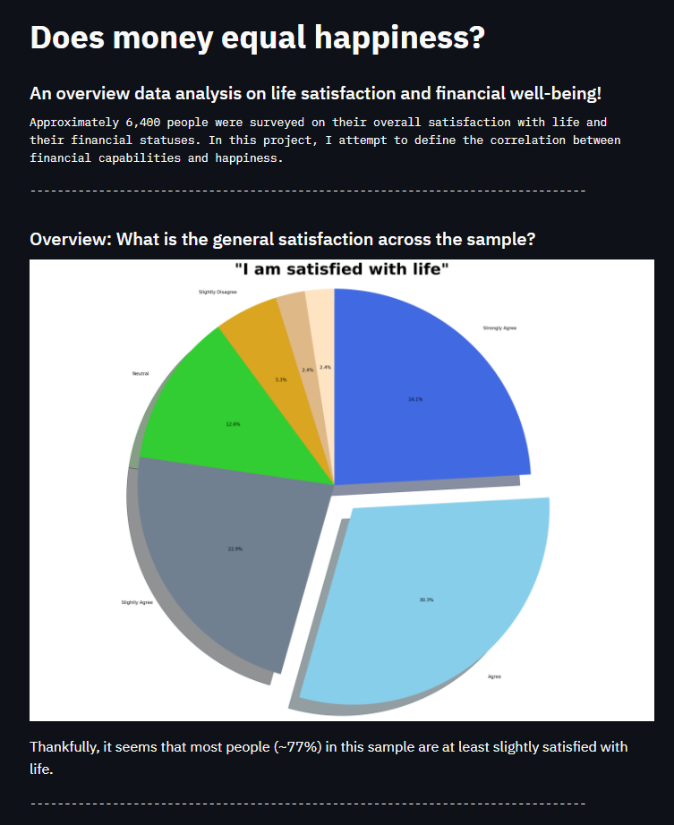
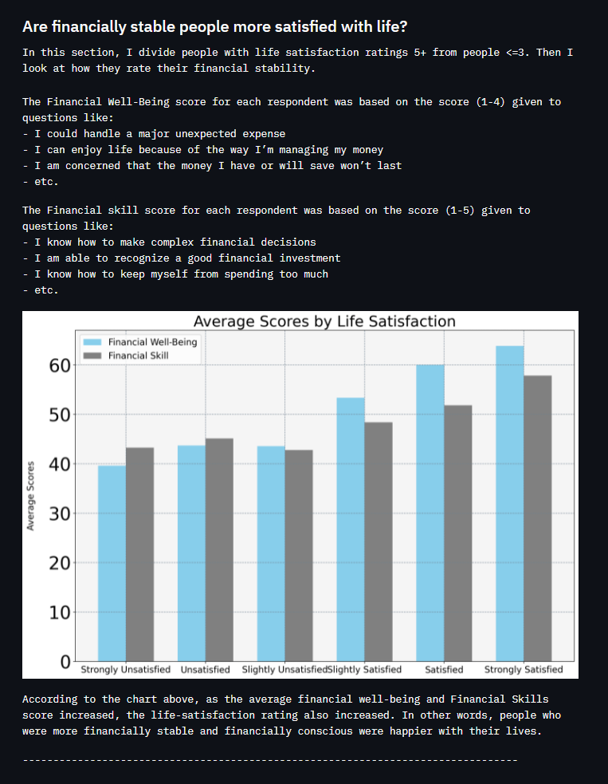
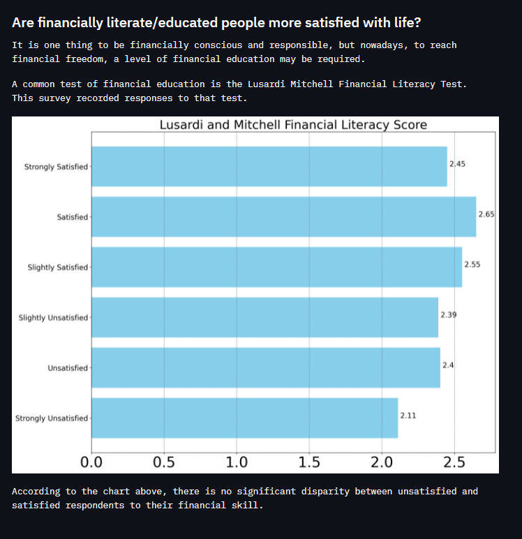

# Money-and-Happiness

This repository holds the web app I created following the course I took that resulted in my [Data Science Web App Guide](https://github.com/gianmillare/Data-Science-Web-App-Guide). The objective of this project was to create data visualizations that interpret the results of the [Consumer Financial Well-being Survey](https://www.kaggle.com/srolka/consumer-financial-wellbeing-survey). 

More importantly, this project was used to test the skills I picked up from the course [Build a Data Science Web App using Streamlit](https://www.coursera.org/learn/data-science-streamlit-python/home/welcome). I think that Streamlit is an incredible library. Being able to build interactive web applications while outputting data reports is enormously convenient. I plan to use the Streamlit library often in future endeavors.

Data Credit: [National Financial Well-Being Survey](https://www.consumerfinance.gov/data-research/financial-well-being-survey-data/)
Data Prep: [Jupyter Notebook](https://nbviewer.jupyter.org/github/gianmillare/Money-and-Happiness/blob/main/data_prep.ipynb)

